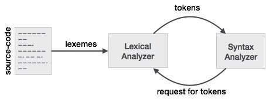

# OctoLab

> OCTOLAB **–** Scientific programming language

##### **Submitted by**

	Bokhodir Urinboev 
	Anvarjon Yusupov 
	Boburjon Iskandarov 
	Dilorom Alieva 
	Feruza Latipova 
	Oybek Amonov 
	Rakhmatjon Khasanov 
	Sardor Allaberganov 

## Setup

You need to install `python3-module`,  `tkinter`,  `gcc`,  `bison`,  `flex`

system requirements : you need to use linux distribution 

if you are using windows with linux subsystem you need to install->xming:https://sourceforge.net/projects/xming/ in order to run graphical interface

## Usage

After installing all the requiremets , you need to run following commands:

```
bison -d parser.y 
flex octolab.l   
gcc -o demo parser.tab.c lex.yy.c
export DISPLAY=:0
python3 editor.py
```

### CONTENTS

SECTION 1 : Abstract 

SECTION 2 : Introduction 

SECTION 3 : Proposed Language Features/Constructs 

SECTION 4 : Design & Implementation of Lexical Analyser using FLEX 

SECTION 5 : Design & Implementation of Syntax Analyzer using BISON 

SECTION 6 : Design & Implementation of Semantics Analyzer and Intermediate Code Generator 

SECTION 7 : Design & Implementation of Code Generator/Virtual Machine 

SECTION 8 : Project Testing Phase **–** Results & Discussion 

SECTION 9 : Conclusion 

SECTION 10 : Future Work 

SECTION 11 : References 

### PROBLEM STATEMENT :

In order to manage time efficiency, we came up with idea to create new language which is focused on simplification and optimization of certain calculations in scientific work. Our new programming language is able to solve problems related to Linear Algebra. Precisely, Matrix operation (addition of matrix, subtraction, multiplication, Gauss-Jordan Elimination). Additionally, projection and Convolution, etc.

## 1. ABSTRACT :

Programming language is becoming very useful tool in different fields. However, the most impact these languages have on sphere of science. Using our simple syntax, any scientist would handle pure calculations. So, now let’s see what happens beyond the cover of the system. First, Source code would be written using unique syntax. Which will have high readability. In order, to achieve that we are combining of strings and phrases that is already familiar to amateur programmers as well as to person who is not familiar with any programming language. Another that is important to us is writability. We are going to avoid complex code structures and use functions that easy to implement. Second, our system would be Pure Interpreter. After going through source program, we identify every lexemes. And categorize into tokens. Next step, would be creating parsing tree using bottom up parsing approach, which is either LR(1) or LALR. We are not using SLR parsing method, due to limitations shift-reduce and reduce-reduce. And after parsing phase, intermediate code will be generated by using pure interpreter. Finally, we may optimize resulted code and then using another interpreting phase convert it into target code.


## 2. INTRODUCTION

There are many examples of languages that were implemented for operations in field of science. Examples are, MATLAB and Octave. Which become great inspirations for our project. Programming languages above, are high-performance languages for technical computing. They integrate computation, visualization, and programming in an easy-to-use environment where problems and solutions are expressed in familiar mathematical notation.

Octolab is similar language, which is also aimed to solve numerical computations. There are many use of this language, it will help us to solve different problems as arithmetic expressions, conditional and binary operations. Octalab has many language evaluation criteria such as:

1. Readability is considered as crucial point of language for judging the level of easiness while reading the code and understanding it easily. We have paid enough attention to make it readable programming language.
2. Writability: Octalab give chance us to write code easily.
3. Simplicity is also important part of programming language. That is why while creating operators we have paid attention to simplicity. We have created different types operation rather than creating many operators which do the same thing
4. Orthogonality: Octalab has useful control statements and meaningful reserved  words
5. Reliability -> low reliability
6. Cost -> Training programmers can use language easily and easy to learn, because of simplicity and orthogonality. Language implementation system is free.

Imperative programming is a paradigm of computer programming in which the program describes a sequence of steps that change the state of the computer. To make programs simpler for a human to read and write, imperative statements can be grouped into sections known as code blocks. Octalab is considered as imperative language.

We have used Pure interpretation process type of implementation. Clearly, translator executes the source program without translating it into machine language first. It look like this:


As MATLAB and OCTAVE in our project we have too many different features and constructs which solve different problems. All of that is achieved, due to scanning of lexical analyzer(flex) and parsing tree constructed with capabilities of integrated parser(bison).


## 3. PROPOSED LANGUAGE FEATURES/CONSTRUCTS :

In order to construct, we have implemented flex, bison and grammar. With the help of flex we divide into tokens. E.g. lexemes-> into tokens.

Octolab is planned to have several powerful features. Those features are:

- Fundamental Arithmetic Operations (addition, subtraction, multiplication, division and power operations)
- Binary Operators (Bitwise AND, OR)
- Precision table, capability of complex arithmetic expressions (combination of multiple factors, terms and parenthesis)
- Supports different datatypes such as integer, float, Boolean and string
- Simple conditional operators (if, else with ==, !=, <, > and >= and <=)
- Basic Loop operators (while)
- Variable declarations
- Integrated Developing Environment
- Etc.

Octolab has integrated several constructs:

- Lexical Analyzer (Flex)
- Bottom-Up Parser (Bison)
- Etc.

IDE is one of the advantages which is included to our project. After writing code in our environment, code must be run in bash shell and result of execution is shown there as well. Screenshots with examples are provided. Code written in IDE and executed on shell:

* Arithmetic and Binary operations and variable declaration and input. Output(left) and Code(right)


* Support of float and int datatypes. Calculation of area


* While loop. Factorial of number calculating and Fibonacci number


* Conditional operators. If and else


* Combination of loop and conditional operators(<,> conditions)


* Conditional operation with >=. Modulus


* Nested If.. else


## 4. DESIGN AND IMPLEMENTATION OF LEXICAL ANALYZER USING FLEX

Here grammar specifications for all the constructs/features of our program language:

```
%%
program: stmts {
/*tree = make_node(0,0,"");
*/
tree = $1;
}
stmt: assignmentStmt {
$$=$1;
}
| ifStmt {
$$=$1;
}
| ifElseStmt {
$$=$1;
}
| whileStmt {
$$=$1;
}
| printStmt {
//$$=make_node(STATEMENT,0,"");
//attach_node($$,$1);
$$=$1;
}
| stmtSeq {
$$=$1;
}

assignmentStmt: IDENTIFIER ASSIGNMENT expr ENDLINE {
$$=make_node(ASSIGNMENT,0,"");
struct Node* temp = make_node(IDENTIFIER,0,$1);
attach_node($$,temp);
attach_node($$,$3);
}
ifElseStmt: IF expr THEN stmt ELSE stmt {
$$=make_node(IF,0,"");


attach_node($$,$2);
attach_node($$,$4);
attach_node($$,$6);
}
ifStmt: IF expr THEN stmt {
$$=make_node(IF,0,"");
attach_node($$,$2);
attach_node($$,$4);
}
whileStmt: WHILE expr DO stmt {
$$=make_node(WHILE,0,"");
attach_node($$,$2);
attach_node($$,$4);
}
printStmt: PRINT expr ENDLINE {
$$=make_node(PRINT,0,"");
attach_node($$,$2);
}
stmtSeq: START stmts END {
$$=$2;
}
stmts: stmt {
$$=make_node(STATEMENT,0,"");
attach_node($$,$1);
}
| stmt stmts {
$$=make_node(STATEMENT,0,"");
attach_node($$,$1);
attach_node($$,$2);
}

/* an expression uses + or - or neither */
expr: NOT expr{
$$=make_node(NOT,0,"");
attach_node($$,$2);
}
| expr PLUS expr {
$$ = make_node(PLUS,0,"");
attach_node($$,$1);
attach_node($$,$3);
}
| expr MINUS expr {
$$ = make_node(MINUS,0,"");
attach_node($$,$1);
attach_node($$,$3);
}
| expr STAR expr {
$$ = make_node(STAR,0,"");


attach_node($$,$1);
attach_node($$,$3);
}
| expr SLASH expr {
$$ = make_node(SLASH,0,"");
attach_node($$,$1);
attach_node($$,$3);
}
| expr LESS expr {
$$ = make_node(LESS,0,"");
attach_node($$,$1);
attach_node($$,$3);
}
| expr LESSEQUAL expr {
$$ = make_node(LESSEQUAL,0,"");
attach_node($$,$1);
attach_node($$,$3);
}
| expr GREAT expr {
$$ = make_node(GREAT,0,"");
attach_node($$,$1);
attach_node($$,$3);
}
| expr GREATEQUAL expr {
$$ = make_node(GREATEQUAL,0,"");
attach_node($$,$1);
attach_node($$,$3);
}
| expr EQUAL expr {
$$ = make_node(EQUAL,0,"");
attach_node($$,$1);
attach_node($$,$3);
}
| expr NOTEQUAL expr {
$$ = make_node(NOTEQUAL,0,"");
attach_node($$,$1);
attach_node($$,$3);
}
| expr AND expr {
$$ = make_node(AND,0,"");
attach_node($$,$1);
attach_node($$,$3);
}
| expr OR expr {
$$ = make_node(OR,0,"");
attach_node($$,$1);
attach_node($$,$3);
}

| OPENPAREN expr CLOSEPAREN {
$$=$2;
}
| IDENTIFIER {
$$=make_node(IDENTIFIER,0,$1);
}
| VALUE {
$$=make_node(VALUE,$1,"");
}
| INPUT {
$$=make_node(INPUT,0,"");
}
```

**The implementation lexical analyzer using Flex (Fast Lexical Analyzer Generator).**



One of the key insights was to break the job into two parts: lexical analysis (also called lexing or scanning) and syntax analysis (or parsing).

Lexical Analysis - one of the initial phases in our compiling process. Source code will be transformed into modified version of source code, so that extra spaces or comments will be removed. modified source code (written in the sentence format), will be taken not as series of unidentified characters, but as a sequence of lexemes. After identifying each lexeme, we go to the phase of analyzing lexeme’s category (digit, alpha, minus, star and so on). Tokens are categories of lexemes.

In current phase, every identified lexeme will be categorized into tokens. For example:

**5+4**

Will be converted into the next form:

digit: ‘ **5** ’; plus: ‘ **+** ’; digit: ‘ **4** ’

In this manner, we identify category of every character/lexeme. Here are the steps that our lexical analyzer goes through:

**Step 1:** An input file describes the lexical analyzer to be generated named lex.l is written in lex language. The lex compiler transforms lex.l to C program, in a file that is always named lex.yy.c.
**Step 2:** The C compiler compile lex.yy.c file into an executable file called a.out.
**Step 3:** The output file a.out take a stream of input characters and produce a stream of
tokens.


Flex (fast lexical analyzer) - is a tool/computer program that generates code scanner or lexers written in C. It has 3 sectional program design.

1. **Definition Section:** The definition section contains the declaration of variables, regular definitions, manifest constants. In the definition section, text is enclosed in “%{ - //- %}” brackets. Anything written in this brackets is copied directly to the file lex.yy.c

   ```
   %{
   #include <stdio.h>
   #include <string.h>
   #include "parser.tab.h"
   %}
   %option noyywrap
   start "{"
   end "}"
   if "if"
   then "then"
   else "else"
   while "while"
   do "do"
   print "print"
   input "input"
   
   digit [0-9]
   alpha [a-zA-Z]
   
   identifier [a-zA-Z_][a-zA-Z0-9_]*
   value [0-9]*\.?[0-9]+
   
   comment %.*\n
   whitespace [ \t\n]
   
   plus "+"
   minus "-"
   slash "/"
   star "*"
   lessEqual <=
   greatEqual >=
   less <
   great >
   equal ==
   not!
   notEqual !=
   and "&&"
   or "||"
   endLine ;
   assignment =
   openParen "("
   closeParen ")"
   undefined.
   ```

2. **Rules Section:** The rules section contains a series of rules in the form: pattern action and pattern must be unintended and action begin on the same line in {} brackets. The rule section is enclosed in “%% - //- %%”.

```
%%
{comment}
{whitespace}
{plus} return 102;
{minus} return 103;
{slash} return 104;
{star} return 105;
{less} return 106;
{great} return 107;
{lessEqual} return 108;
{greatEqual} return 109;
{equal} return 110;
{notEqual} return 111;
{and} return 112;
{or} return 113;
{not} return 114;
{endLine} return 115;
{assignment} return 116;
{openParen} return 117;
{closeParen} return 118;
{start} return 119;
{end} return 120;


{if} return 121;
{then} return 122;
{else} return 123;
{while} return 124;
{do} return 125;
{print} return 126;
{input} return 127;
{identifier} {strcpy(yylval.str,yytext); return 100;}
{value} {yylval.val =atof(yytext); return 101;}
{undefined} printf("Error: character not defined\n"); return 0;
%%
```


3. **User Code Section:** This section contains C statements and additional functions. We can also compile these functions separately and load with the lexical analyzer.

   ```
   main(int argc, char *argv[])
   {
   if(argc<2){
   printf("Error: you must pass a file to be lexed\n");
   return 0;
   }
   stdin = fopen(argv[1], "r");
   if(stdin==NULL){
   printf("Error: file does not exist\n");
   return 0;
   }
   //while(yylex()!=0);
   int token=1;
   while(token!=0){
   token=yylex();
   if(token>10)
   printf("%d\n",token);
   }
   }
   ```

In computer science, a **symbol table** is a data structure used by a language translator such as a compiler or interpreter, where each identifier (a.k.a. symbol) in a program's source code is
associated with information relating to its declaration or appearance in the source


## 5. DESIGN AND IMPLEMENTATION OF SYNTAX ANALYZER/PARSER USING BISON:

GNU Bison, commonly known as Bison, is a parser generator that is part of the GNU Project. Bison reads a specification of a context-free language, warns about any parsing ambiguities, and
generates a parser which reads sequences of tokens and decides whether the sequence conforms to the syntax specified by the grammar.

Bison takes a grammar that you specify and writes a parser that recognizes valid “sentences” in that grammar. We use the term sentence here in a fairly general way—for a C language grammar, the sentences are syntactically valid C programs. Programs can be syntactically valid but semantically invalid, for example, a C program that assigns a string to an integer variable. Bison handles only the syntax; other validation is up to you.


A bison specification has the same three-part structure as a flex specification. (Flex copied its structure from the earlier lex, which copied its structure from yacc, the predecessor of bison.) The first section, the definition section, handles control information for the parser and generally sets up the execution environment in which the parser will operate. The second section contains the rules for the parser, and the third section is C code copied verbatim into the generated C program.

The first section of the parser uses the %union construct to declare types to be used in the values of symbols in the parser. Besides libraries we have declared some structures and functions that are focused on Nodes, etc.

```
%{
#include <assert.h>
#include <stdlib.h>
#include <stdio.h>
#include <string.h>
#define ID_SIZE 100
#define MAX_CHILDREN 3
#define STATEMENT 201
struct entry{
char *key;
float value;
};
int yywrap( );
void yyerror(const char* str);

struct Node* make_node(int type, double value, char* id);
void attach_node(struct Node* parent, struct Node* child);
void addVar(struct entry table[1000],char *var,float value);
void eval_stmt(struct Node* node,struct entry hashtable[1000]);
float eval_expr(struct Node* node,struct entry hashtable[1000]);
float getVar(struct entry hashtable[1000],char *name);

struct Node* tree;
/* a tree node definition */
struct Node {
/* the type of the node */
int type;

/* the value of the node if it can have one */
double value;

/* the id of the node (used for identifiers only) */
char id[ID_SIZE];

/* at most three children nodes */
int num_children;
struct Node* children[MAX_CHILDREN];
};

%}
```

After that, there comes tokens declaration. Section is marked with % before every token declaration. Among tokens, there is also union function. The first section of the

parser uses the %union construct to declare types to be used in the values of symbols in the parser. In a bison parser, every symbol, both tokens and nonterminals, can have a value associated with it. By default, the values are all integers, but useful programs generally need more sophisticated values. The %union construct, as its name suggests, is used to create a C language union declaration for symbol values. In this case, the union has two members; a, which is a pointer to an AST, and d, which is a double precision number.

```
%token ENDLINE 115
%token ASSIGNMENT 116
%token START 119
%token END 120
%token IF 121
%token THEN 122
%token ELSE 123
%token WHILE 124
%token DO 125
%token PRINT 126
%token INPUT 127
%token <str> IDENTIFIER 100
%token <val> VALUE 101

%right THEN
%right ELSE

%left OR 113
%left AND 112
%left LESS 106 LESSEQUAL 108 GREAT 107 GREATEQUAL 109 EQUAL 110 NOTEQUAL
111
%left PLUS 102 MINUS 103
%left STAR 105 SLASH 104
%right NOT 114
%right OPENPAREN 117
%left CLOSEPAREN 118

%union{
double val;
struct Node* node;
char str[100];
}

%type <node> assignmentStmt
%type <node> ifStmt
%type <node> whileStmt
%type <node> ifElseStmt
%type <node> printStmt
%type <node> stmtSeq
%type <node> expr


%type <node> stmt
%type <node> stmts
/* give us more detailed errors */
%error-verbose
```

The next section, is declaration section. It contains the rules for the parser. By convention, literal character tokens are used to represent input tokens consisting of the same character; for example, the token '+' represents the input token +, so in practice they are used only for punctuation and operators. There’s no need to declare literal character tokens unless you need 
to declare the type of their values.

```
%%

program: stmts {
/*tree = make_node(0,0,"");
*/
tree = $1;
}
stmt: assignmentStmt {
$$=$1;
}
| ifStmt {
$$=$1;
}
| ifElseStmt {
$$=$1;
}
| whileStmt {
$$=$1;
}
| printStmt {
//$$=make_node(STATEMENT,0,"");
//attach_node($$,$1);
$$=$1;
}
| stmtSeq {
$$=$1;
}

assignmentStmt: IDENTIFIER ASSIGNMENT expr ENDLINE {
$$=make_node(ASSIGNMENT,0,"");
struct Node* temp = make_node(IDENTIFIER,0,$1);
attach_node($$,temp);
attach_node($$,$3);
}
ifElseStmt: IF expr THEN stmt ELSE stmt {
$$=make_node(IF,0,"");
attach_node($$,$2);


attach_node($$,$4);
attach_node($$,$6);
}
ifStmt: IF expr THEN stmt {
$$=make_node(IF,0,"");
attach_node($$,$2);
attach_node($$,$4);
}
whileStmt: WHILE expr DO stmt {
$$=make_node(WHILE,0,"");
attach_node($$,$2);
attach_node($$,$4);
}
printStmt: PRINT expr ENDLINE {
$$=make_node(PRINT,0,"");
attach_node($$,$2);
}
stmtSeq: START stmts END {
$$=$2;
}
stmts: stmt {
$$=make_node(STATEMENT,0,"");
attach_node($$,$1);
}
| stmt stmts {
$$=make_node(STATEMENT,0,"");
attach_node($$,$1);
attach_node($$,$2);
}

/* an expression uses + or - or neither */
expr: NOT expr{
$$=make_node(NOT,0,"");
attach_node($$,$2);
}
| expr PLUS expr {
$$ = make_node(PLUS,0,"");
attach_node($$,$1);
attach_node($$,$3);
}
| expr MINUS expr {
$$ = make_node(MINUS,0,"");
attach_node($$,$1);
attach_node($$,$3);
}
| expr STAR expr {
$$ = make_node(STAR,0,"");
attach_node($$,$1);


attach_node($$,$3);
}
| expr SLASH expr {
$$ = make_node(SLASH,0,"");
attach_node($$,$1);
attach_node($$,$3);
}
| expr LESS expr {
$$ = make_node(LESS,0,"");
attach_node($$,$1);
attach_node($$,$3);
}
| expr LESSEQUAL expr {
$$ = make_node(LESSEQUAL,0,"");
attach_node($$,$1);
attach_node($$,$3);
}
| expr GREAT expr {
$$ = make_node(GREAT,0,"");
attach_node($$,$1);
attach_node($$,$3);
}
| expr GREATEQUAL expr {
$$ = make_node(GREATEQUAL,0,"");
attach_node($$,$1);
attach_node($$,$3);
}
| expr EQUAL expr {
$$ = make_node(EQUAL,0,"");
attach_node($$,$1);
attach_node($$,$3);
}
| expr NOTEQUAL expr {
$$ = make_node(NOTEQUAL,0,"");
attach_node($$,$1);
attach_node($$,$3);
}
| expr AND expr {
$$ = make_node(AND,0,"");
attach_node($$,$1);
attach_node($$,$3);
}
| expr OR expr {
$$ = make_node(OR,0,"");
attach_node($$,$1);
attach_node($$,$3);
}
| OPENPAREN expr CLOSEPAREN {


$$=$2;
}
| IDENTIFIER {
$$=make_node(IDENTIFIER,0,$1);
}
| VALUE {
$$=make_node(VALUE,$1,"");
}
| INPUT {
$$=make_node(INPUT,0,"");
}

%%
```

The third section contains C subroutines. That does different things (evaluate expressions, variable operations, yyerror and yywrap)

```
void print_tree(struct Node* node, int tabs) {

int i;

/* base case */

if(!node){

printf("!node");

return;

}

/* print leading tabs */

for(i = 0; i < tabs; i++) {

printf(" ");

}

switch(node->type) {

case IDENTIFIER: printf("IDENTIFIER: %s\n", node->id); break;

case VALUE: printf("VALUE: %lf\n", node->value); break;

case PLUS: printf("PLUS:\n"); break;

case MINUS: printf("MINUS:\n"); break;

case SLASH: printf("DIVIDE:\n"); break;


case STAR: printf("TIMES:\n"); break;

case LESS: printf("LESS THAN:\n"); break;

case GREAT: printf("GREATER:\n"); break;

case LESSEQUAL: printf("LESS EQUAL:\n"); break;

case GREATEQUAL: printf("GREATER EQUAL:\n"); break;

case EQUAL: printf("EQUALS:\n"); break;

case NOTEQUAL: printf("NOT EQUALS:\n"); break;

case AND: printf("AND:\n"); break;

case OR: printf("OR:\n"); break;

case NOT: printf("NOT:\n"); break;

case ASSIGNMENT: printf("ASSIGN:\n"); break;

case IF: printf("IF:\n"); break;

case WHILE: printf("WHILE:\n"); break;

case PRINT: printf("PRINT:\n"); break;

case INPUT: printf("INPUT:\n"); break;

case STATEMENT: printf("STATEMENT:\n"); break;

default:

printf("Error, %d not a valid node type.\n", node->type);

exit(1);

}

/* print all children nodes underneath */

for(i = 0; i < node->num_children; i++) {

print_tree(node->children[i], tabs + 1);

}

}

/* creates a new node and returns it */


struct Node* make_node(int type, double value, char* id) {

int i;

/* allocate space */

struct Node* node = malloc(sizeof(struct Node));

/* set properties */

node->type = type;

node->value = value;

strcpy(node->id, id);

node->num_children = 0;

for(i = 0; i < MAX_CHILDREN; i++) {

node->children[i] = NULL;

}

/* return new node */

return node;

}

/* attach an existing node onto a parent */

void attach_node(struct Node* parent, struct Node* child) {

/* connect it */

parent->children[parent->num_children] = child;

parent->num_children++;

assert(parent->num_children <= MAX_CHILDREN);

}

int yywrap( ) {

return 1;

}


void yyerror(const char* str) {

fprintf(stderr, "Interpreter error: '%s'.\n", str);

}

void eval_stmt(struct Node* node,struct entry hashtable[1000]){

int i;

if(!node){

printf("Base case");

return;

}

switch(node->type) {

case ASSIGNMENT:

addVar(hashtable,node->children[0]->id,eval_expr(node-

>children[1],hashtable));

break;

case IF:

if((int)eval_expr(node->children[0],hashtable)){

eval_stmt(node->children[1],hashtable);

} else if (node->num_children>2){//check for else

eval_stmt(node->children[2],hashtable);

}

break;

case WHILE:

while((int)eval_expr(node->children[0],hashtable)){

eval_stmt(node->children[1],hashtable);

}

break;

case PRINT: printf("%f\n",eval_expr(node->children[0],hashtable)); break;

case STATEMENT:


for (i=0;i<node->num_children;i++){

eval_stmt(node->children[i],hashtable);

}

break;

default:

printf("Error, %d not a valid node type.\n", node->type);

exit(1);

}

}

float eval_expr(struct Node* node,struct entry hashtable[1000]){

float input;

switch(node->type){

case INPUT:

scanf("%f",&input);

//printf("Inpute: %f",input);

return input;

break;

case IDENTIFIER:

//printf("Node ID: %s",node->id);

return getVar(hashtable,node->id);

break;

case VALUE: return node->value; break;

case PLUS:

return (eval_expr(node->children[0],hashtable)+eval_expr(node-

>children[1],hashtable));

break;

case MINUS:

return (eval_expr(node->children[0],hashtable)-eval_expr(node-

>children[1],hashtable));

break;


case SLASH:

return (eval_expr(node->children[0],hashtable)/eval_expr(node-

>children[1],hashtable));

break;

case STAR:

return (eval_expr(node->children[0],hashtable)*eval_expr(node-

>children[1],hashtable));

break;

case LESS:

if(eval_expr(node->children[0],hashtable)<eval_expr(node-

>children[1],hashtable))

return 1;

else

return 0;

break;

case GREAT:

if(eval_expr(node->children[0],hashtable)>eval_expr(node-

>children[1],hashtable))

return 1;

else

return 0;

break;

case LESSEQUAL:

if(eval_expr(node->children[0],hashtable)<=eval_expr(node-

>children[1],hashtable))

return 1;

else

return 0;

break;

case GREATEQUAL:

if (eval_expr(node->children[0],hashtable)>=eval_expr(node-

>children[1],hashtable))


return 1;

else

return 0;

break;

case EQUAL:

if (eval_expr(node->children[0],hashtable)==eval_expr(node-

>children[1],hashtable))

return 1;

else

return 0;

break;

case NOTEQUAL:

if(eval_expr(node->children[0],hashtable)!=eval_expr(node-

>children[1],hashtable))

return 1;

else

return 0;

break;

case AND:

if(eval_expr(node->children[0],hashtable)&&eval_expr(node-

>children[1],hashtable))

return 1;

else

return 0;

break;

case OR:

if(eval_expr(node->children[0],hashtable)||eval_expr(node-

>children[1],hashtable))

return 1;

else

return 0;

break;


case NOT:if((int)eval_expr(node->children[0],hashtable)==0)

return 1;

else

return 0;

break;

default:

printf("Error, %d not a valid node type/expression.\n",node->type);

exit(1);

}

}

int hash_function(struct entry table[1000],char *varName){

int hash=((varName[0]*26)+varName[1]+varName[2])%1000;

while ((table[hash].key!=NULL)&&(strcmp(table[hash].key,varName))){

//printf("%d %d\n",table[hash].key!=NULL,table[hash].key!=varName);

//printf("Keys: Passed: \"%s\" Found: \"%s\"",varName,table[hash].key);

hash=((hash+1)%1000);

}

//printf("Hash: %d\n",hash);

return hash;

}

void addVar(struct entry table[1000],char *var,float value){

int index = hash_function(table,var);

table[index].key=var;

table[index].value=value;

//printf("Var: %s added with Value: %f\n", var,value);

}

float getVar(struct entry table[1000],char *var){

int index = hash_function(table,var);


//printf("Var: %s, Value: %f\n",var,table[index].value);

return table[index].value;

}

int main(int argc, char *argv[]) {

if(argc<2){

printf("error: pass sloth source");

return 0;

}

FILE* orig_stdin=stdin;

stdin = fopen(argv[1],"r");

if(stdin==NULL){

printf("Error: file does not exist\n");

return 0;

}

yyparse();

//print_tree(tree,1);

fclose(stdin);

stdin=orig_stdin;

struct entry hashtable[1000];//should've just used a global var

int i;

for (i=0;i<1000;i++){

//printf("%d",i);

hashtable[i].key=NULL;

hashtable[i].value=0;

}

/*

addVar(hashtable,"x",1);

addVar(hashtable,"y",2);


addVar(hashtable,"a",3);

addVar(hashtable,"b",4);

addVar(hashtable,"temp",5);

addVar(hashtable,"foo",6);

addVar(hashtable,"bar",7);

addVar(hashtable,"x",12);

printf("%f\n",getVar(hashtable,"x"));

printf("%f\n",getVar(hashtable,"y"));

printf("%f\n",getVar(hashtable,"a"));

printf("%f\n",getVar(hashtable,"b"));

printf("%f\n",getVar(hashtable,"temp"));

printf("%f\n",getVar(hashtable,"foo"));

printf("%f\n",getVar(hashtable,"bar"));

*/

for (i=0;i<1000;i++){

;

//printf("%f\n",hashtable[i].value);

}

eval_stmt(tree,hashtable);

return 0;

}
```

In order to illustrate parsing process(parsing tree), we added function. Print tree


Here example, of the simple code processing:


And parsing process:


As we are seeing. Every parsing of each token is shown.

Example of more complicated program:


Identifies min and max value. From given inputs


Parsing of every given token

Program with nested if ..else:


And parsing of it:


## 6. DESIGN AND IMPLEMENTATION OF SEMANTICS ANALYZER & INTERMEDIATE CODE GENRATOR FOR A HYPOTHETICAL MACHINE

Semantics of a language provide meaning to its constructs, like tokens and syntax structure. Semantics help interpret symbols, their types, and their relations with each other. Semantic analysis judges whether the syntax structure constructed in the source program derives any meaning or not.

However, in our case Flex and Bison are handling those problems by themselves. Thus, there is no requirement for additional semantics analysing.

We have written manually some error handlers that are not covered by flex and bison. Errors like zero division, in case of dividing to zero, output is inf (stands for infinity).


## 7. DESIGN & IMPLEMENTATION OF CODE GENERATOR(COMPILER)/ VIRTUAL MACHINE(INTERPRETER)

Due to the fact, that our system is Pure Interpreter. We don’t have any virtual machine nor code generator. Because Pure Interpreter is direct line by line executor.

However, our third section of parser includes subroutines to handle operations. Next are functions that we implemented:

**NODES**

In order to keep track of parsing tree, we included structure for Node. It contains type, value, id, number of childs and pointer to childs


To make node, we first allocate memory (equal to the size of structure). And the assign given values to the variables of structure


Another operation that is required, to attach created node to the parent.


After that, almost every operation is done by the use of Nodes. For example, function below, after identifies type of statement it performs operations with hashtable


Evaluate expression, function below, does all the calculations. After identifying type of parent node(plus, minus etc.) it performs corresponding operation with left and right child of the node


Hash function is required to keep the link between variable and it’s value. Technically it works as dictionary. So that we always know which value is assigned to the specific variable.


Function to print tree. It is called every time when token is taken. So that depending on the token, program outputs the it’s type


## 8. PROJECT TESTING PHASE - RESULTS & DISCUSSION:

We have constructed Integrated Development Environment, in order to improve user experience of writing our code.

**IDE - An integrated development environment (IDE)** is a software application that provides comprehensive facilities to computer programmers for software development. Developers use
numerous tools throughout software code creation, building and testing. Development tools often include text editors, code libraries, compilers and test platforms.

Traditionally IDE includes source code editor with some facilities for automation and debugging. In our case, integrated environment represents code editor.

Here interface of our code editor:


There are 4 tabs: File, Edit, Help and Run

* File

Allows you to open new file or open already existing. Apart from that, there save option and exit


Process of opening new file requires to enter name for that file and extension file may be chosen. We have developed our own extension (.oct). In case of choosing open recent, window below
would appear:


From picture above, we see that user has to choose file. Similar window appears in case of saving new file.

* Edit
Allows to work directly with the file itself.

* Help
Provides necessary information about OctoLab.

* Run
Run button, creates directory object that is passed to our code. And execution of that object is invoked. The result of execution must be seen in the shell.

Example of written code, that is executed(raising a to power of b):


## 9. CONCLUSION:

By efficient use of unique skills of every member, our team managed to create advanced scientific programming language. Our goals were to design code with high readability, writability and reliability. We tried to get best feature from MatLab and Octave. Our team accomplished to implement basic functionalities that are needed in every programing language. Additionally, there were included conditional statements, looping, variables and some other features. We constructed our code by combining flex and bison technology. As well as, different advantages of C language.

Although there are some flaws, results were good. The lack of functionality is just current problem, because we managed to build platform. So in future it would be much simpler to add new functions. Our parser and flex is performing on high level, that’s why our programming language has great potential to make breakthrough.

## 10. FUTURE WORK:

Current state of our programming language can be described as beta version of OctaLab. Cause despite to existing features of it, it still requires code optimization and bust in functionality. Right
now, programming language is perfectly handling basic arithmetic and binary operations, conditional operations, loops and etc. There are still lack in advanced operations that exist in MatLab and Octave.

Our aim. that we are focusing right now is to upgrade functionality set of OctaLab. Our initial plan to construct programming language alike Matlab or Octave has been accomplished with some flaws. Due to that, our next steps would be adding matrix operations that we planned from the beginning and also include plotting function.

Another aim, that we are headed to achieve is to upgrade our IDE, integrate shell into the editor. So that user may observe execution of his/her code directly in the editor.


## 11. REFERENCES:

[1] The Design and Implementation of a Parser and Scanner for the MATLAB Language in the MATCH Compiler by Pramod G. Joisha, Abhay Kanhere, Prithviraj Banerjee, U. Nagaraj Shenoy and Alok Choudhary

[2] Flex and Bison by John Levine; OReilly Lex

[3] Concepts of Programming Language, 10th Edition, by Robert W. Sebesta

[4] https://ruslanspivak.com/lsbasi-part1/

[5] https://www.mathworks.com/help/matlab/

[6] https://medium.com/hackernoon/compilers-and-interpreters-3e354a2e41cf

[7] https://octave.sourceforge.io/docs.php

[8] https://www.geeksforgeeks.org/flex-fast-lexical-analyzer-generator/